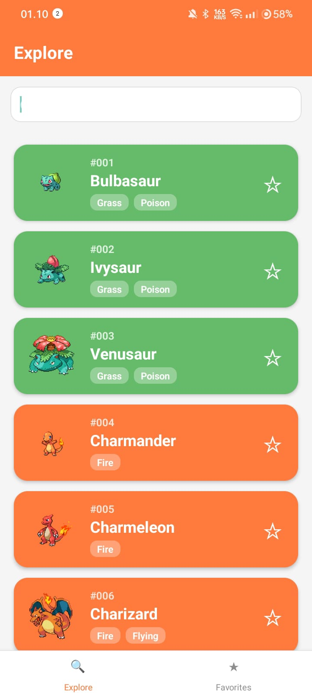
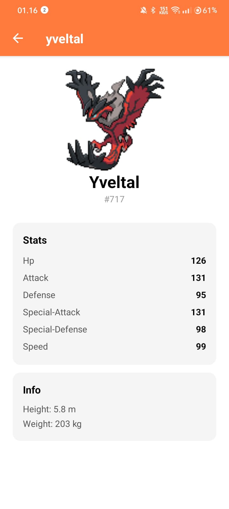
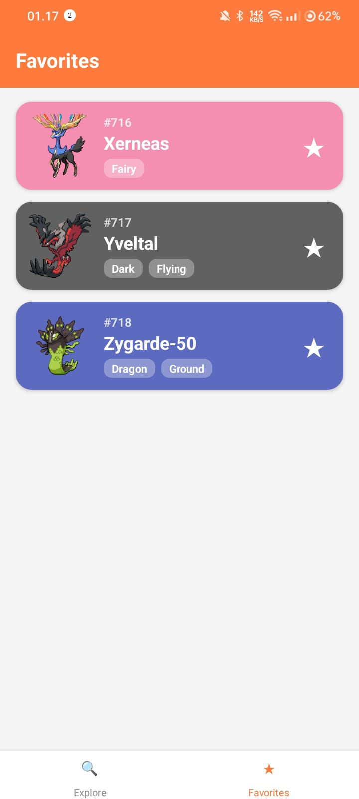
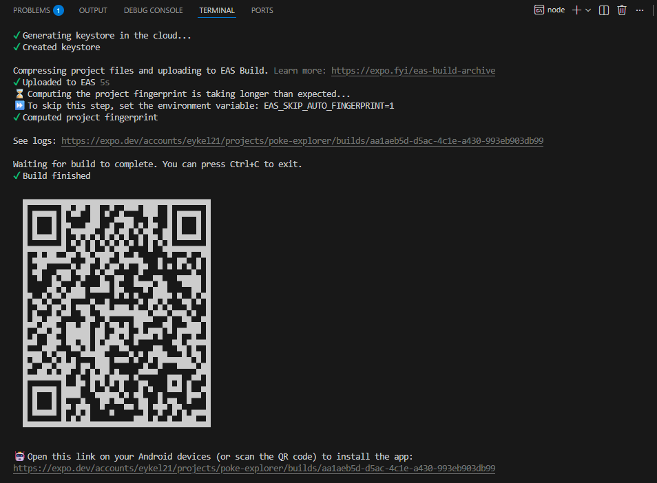
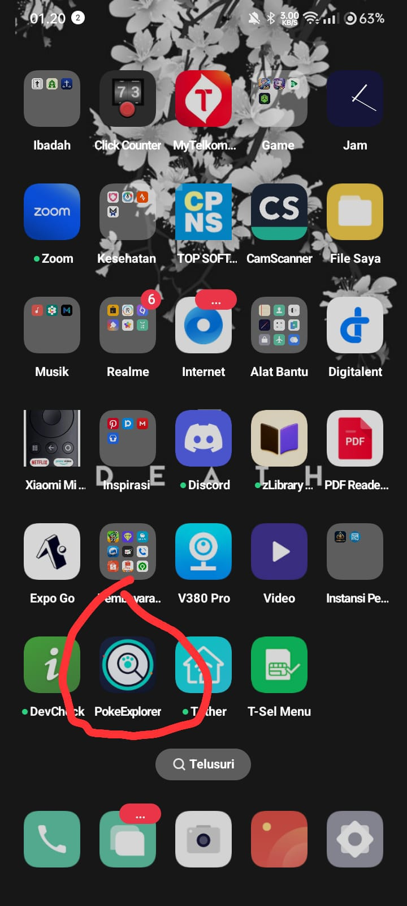
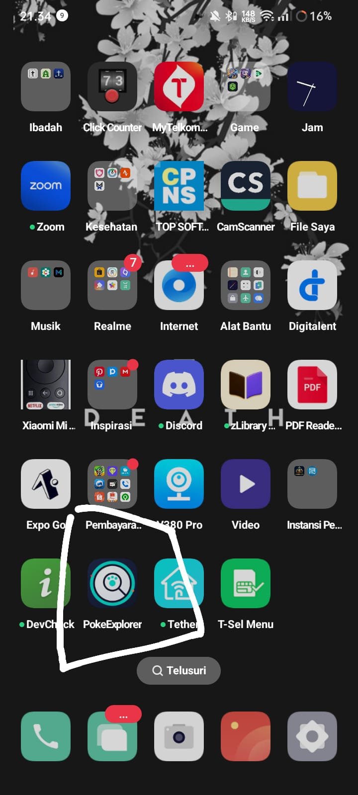

# PokeExplorer 🔍

Aplikasi Android untuk menjelajahi database Pokémon menggunakan [PokéAPI](https://pokeapi.co/), dibangun dengan React Native + Expo sebagai bagian dari tugas Mobile Programming (Misi 14 — Release Candidate).

> **App ini adalah PokeExplorer, aplikasi eksplorasi data Pokémon. Fitur utamanya: infinite scroll list, pencarian, detail stats, dan sistem favorit tersimpan lokal.**

## 📱 Download APK

**[⬇️ Download APK dari EAS Dashboard](https://expo.dev/accounts/eykel21/projects/poke-explorer/builds/aa1aeb5d-d5ac-4c1e-a430-993eb903db99)**

> Link build FINISHED juga bisa dilihat di https://expo.dev — masuk ke project `poke-explorer` → tab Builds.

## ✨ Fitur Utama

- **Infinite Scroll** — daftar Pokémon dimuat bertahap (pagination 20 data/batch) langsung dari PokéAPI
- **Pencarian** — filter cepat berdasarkan nama Pokémon
- **Detail Lengkap** — stats (HP, Attack, Defense, dst), tinggi, dan berat
- **Favorites** — simpan Pokémon favorit secara persisten dengan `AsyncStorage`, tetap ada walau app ditutup
- **Animasi** — fade-in + scale animation pada setiap card saat muncul di layar
- **App Version Display** — versi app ditampilkan otomatis di footer (dibaca dari `app.json` via `expo-constants`)

## 🛠️ Tech Stack

- React Native (Expo SDK 56)
- React Navigation (Bottom Tabs + Native Stack)
- AsyncStorage untuk penyimpanan lokal
- PokéAPI (REST API publik)
- EAS Build untuk build APK release

## 📲 Cara Install APK

1. Download file `.apk` dari link di atas lewat browser HP Android
2. Buka file APK yang sudah didownload
3. Jika muncul peringatan "Install blocked" / "Unknown sources", izinkan instalasi dari sumber ini di pengaturan
4. Tap **Install**, tunggu selesai, lalu buka aplikasinya

## 🖼️ Screenshot

| Home (Explore) | Detail | Favorites |
|---|---|---|
|  |  |  |

| Build FINISHED di EAS | Dialog install di HP | Icon di app drawer |
|---|---|---|
|  |  |  |

## 🚀 Menjalankan Secara Lokal (Development)

```bash
npm install
npx expo start
```

Scan QR code dengan aplikasi **Expo Go** di HP Android/iOS.

## 🏗️ Build APK Sendiri

```bash
npm install -g eas-cli
eas login
eas init
eas build --platform android --profile preview
```

## 🔖 Riwayat Versi

| Versi | Version Code | Catatan |
|---|---|---|
| 1.0.0 | 1 | Rilis pertama - fitur inti lengkap |

## 🎮 Coba Online (Expo Snack)

Versi interaktif app ini bisa dicoba langsung di browser tanpa install:
**[Buka di Expo Snack](https://snack.expo.dev/@eykel21/8635cb)**

---
Dibuat oleh Eykel Agitha Kembaren — Sistem Informasi, Universitas Prima Indonesia
